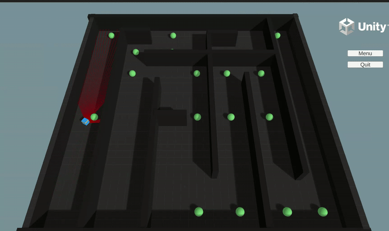
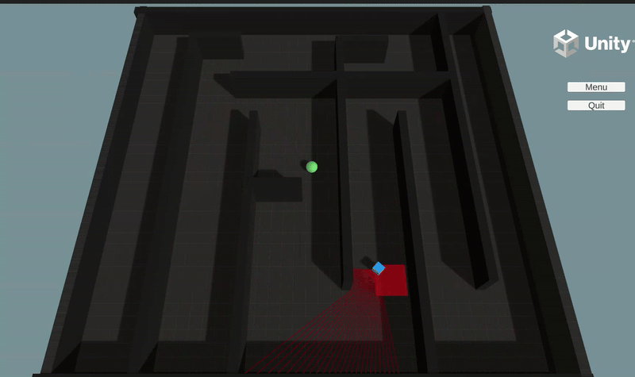

# Maze Solver with Reinforcement Learning (RL) using Reward Shaping in Unity

This project demonstrates a **Maze Solver** game built with **Reinforcement Learning (RL)** using **Reward Shaping** techniques, developed as part of the **Advanced Topics on Intelligent Systems** course at **FEUP (Faculty of Engineering of the University of Porto)**. The goal of this project is to solve a maze by training an AI agent using RL, improving its decision-making process through reward shaping to navigate efficiently.

  

## Authors:
- Bruno Costa
- Pedro Oliveira

## Final GPA 
20/20

### Key Features:
- **Reinforcement Learning**: The AI agent learns optimal movement strategies through trial and error.
- **Reward Shaping**: A technique used to modify the reward function to speed up learning by guiding the agent towards desirable behaviors.
- **Unity Game Engine**: Developed using Unity, providing a flexible environment for visualizing and interacting with the maze and the RL agent.
- **Cross-Platform**: The project includes executable files for **Linux**, **Mac**, and **Windows** systems, ensuring compatibility across different platforms.

### Installation & Usage:
1. **Download the Executable**:
   - You can find the pre-built executables for **Linux**, **Mac**, and **Windows** in the `git` section of this repository.

2. **Run the Game**:
   - Simply download the appropriate file for your operating system and run the executable.

3. **Game Instructions**:
   - The game starts with a main menu that leads to 3 different scenes:
     - **Menu**:
       
     - **Scene 1**:
       
     - **Scene 2**:
       
     - **Scene 3**:
       
   - The agent must find the path from the start to the end using reinforcement learning techniques.
   - The agent receives positive or negative rewards based on its actions.
   - You can observe the agent's learning progress and decision-making process over time.

### Technologies Used:
- **Unity**: Game engine for creating and visualizing the maze environment and the RL agent.
- **Reinforcement Learning (RL)**: The core technique for training the agent, allowing it to improve its decision-making over time.
- **Reward Shaping**: Used to modify the reward function, providing additional guidance to the agent during training.

### Development Repository:
- The repository containing the developed code can be found here [devel](https://github.com/brumocas/RL_Project).

### Conclusion:
This project showcases how **Reinforcement Learning** and **Reward Shaping** can be applied to solve dynamic and complex maze navigation problems. The game provides an interactive way to visualize RL concepts while offering a challenging environment for the AI agent.
